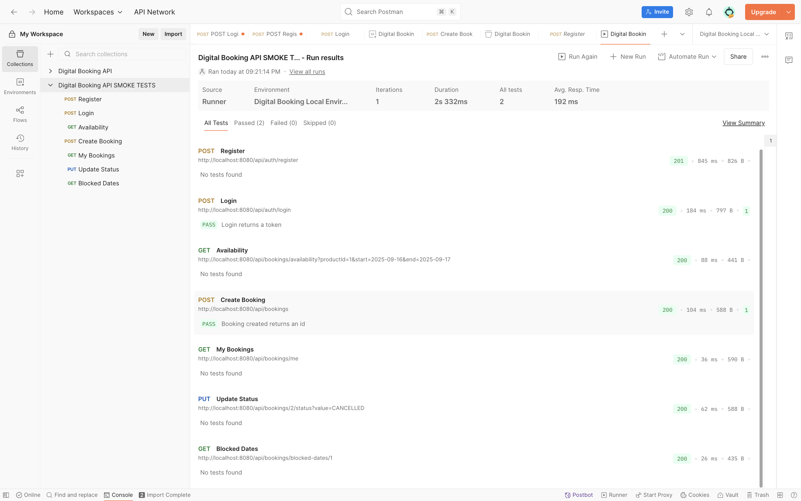

# TESTING.md

> **Objetivo:** Documentar la planificación y ejecución de pruebas del proyecto de reservas (Backend Spring Boot + Frontend React).  
> **Alcance:** Tests manuales (Postman/cURL) y sugerencias de tests automáticos (JUnit/H2).  
> **Entregable:** Este documento + colección Postman + capturas.

---

## 1) Estrategia de pruebas

- **Tipos de pruebas**
  - **Smoke tests**: chequeo rápido de circuitos críticos (Auth, Productos, Reservas).
  - **Funcionales (API)**: por historia de usuario y por endpoint.
  - **Front-End (UI manual)**: validación de flujos claves (login, buscar, reservar, mis reservas).
  - **Regresión rápida**: re-ejecutar smoke tras cambios.
  - **(Opcional recomendado)**: Tests automáticos de servicio con **JUnit + H2**.

- **Criterios de salida**
  - Smoke tests **OK**.
  - Casos por **historia de usuario** ejecutados con resultados esperados.
  - Documentación y evidencias adjuntas.

---

## 2) Ambientes y herramientas

- **Backend (local)**: `http://localhost:8080`
- **Frontend (local)**: `http://localhost:5174`
- **Base de datos**: MySQL (dev) / H2 (tests)
- **Herramientas**
  - **Postman** (colección y environment)
  - **cURL** (terminal)
  - **Chrome DevTools** (Application ▸ Local Storage)
  - **JUnit 5** (sugerido para automatizar parte de reservas/productos)

---

## 3) Datos de prueba

- **Usuario de prueba (registro/login)**
  - email: `vale@example.com`
  - password: `Password123!`
  - username: `valentina`
  - firstName: `Valentina`, lastName: `Serna`

- **Producto existente**: usar un `productId` **real** de la BD.  
  - Si no recuerdas uno, consulta: `GET /api/products` (Swagger/Postman).

- **Rango de fechas** de prueba (modificables):
  - Disponibilidad libre: `2025-09-16` a `2025-09-17`
  - Cruce para probar no-disponibilidad: reutilizar fechas ya reservadas

---

## 4) Matriz de trazabilidad (User Stories ↔ Pruebas)

### Sprint 1 (Fundaciones & catálogo)
| Historia | Descripción | Caso(s) de Prueba | Evidencia |
|---|---|---|---|
| #1 Header | Header visible y fijo | UI: Ver header en todas las vistas | Capturas front |
| #2 Main | Background/estructura | UI: Secciones buscador/categorías/recomendados | Capturas front |
| #3 Registrar producto | Alta de producto | API: `POST /api/products`, UI: Admin alta | Postman/cURL + capturas |
| #4 Productos aleatorios | Home muestra ≤10, sin repetidos | API/UI: `GET /api/products/random?limit=10` o home | Capturas home |
| #5 Detalle producto | Vista detalle | UI: `/product/:id` | Capturas UI |
| #6 Galería imágenes | 5 imágenes, layout responsivo | UI: galería en detalle | Capturas UI |
| #7 Footer | Footer visible | UI: footer en todas las vistas | Capturas UI |
| #8 Paginación | ≤10 por página | UI: paginación en home/list | Capturas UI |
| #9 Panel admin | `/administration` accesible | UI: navegación admin | Capturas UI |
| #10 Listar productos | Admin lista | API/UI: `GET /api/products` y vista admin | Capturas |
| #11 Eliminar producto | Borrar con confirmación | API: `DELETE /api/products/{id}`, UI: acción | Postman/cURL + capturas |

### Sprint 2 (Features, Búsquedas, Auth/JWT)
| Historia | Descripción | Caso(s) de Prueba | Evidencia |
|---|---|---|---|
| Features ↔ Products | Asignación y filtro | API: `/api/features`, filtro en productos | Capturas y JSON |
| Búsqueda avanzada | Filtros (ciudad, cat, price, features, q) | API: `/api/products/search` | Postman/cURL |
| Auth JWT | Register/Login + rutas protegidas | `/api/auth/register`, `/api/auth/login`, header Bearer | Postman/cURL, DevTools |

### Sprint 3 (Reservas)
| Historia | Descripción | Caso(s) de Prueba | Evidencia |
|---|---|---|---|
| Disponibilidad | Check availability | `GET /api/bookings/availability` | Postman/cURL |
| Crear reserva | Crear con JWT | `POST /api/bookings` | Postman/cURL |
| Mis reservas | Listado del usuario | `GET /api/bookings/me` | Postman/cURL |
| Fechas bloqueadas | Calendario por producto | `GET /api/bookings/blocked-dates/{productId}` | Postman/cURL |
| Cambiar estado | Cancelar/Actualizar status | `PUT /api/bookings/{id}/status?value=CANCELLED` | Postman/cURL |

### Sprint 4 (Frontend: UX/Flujos)
| Historia | Descripción | Caso(s) de Prueba | Evidencia |
|---|---|---|---|
| Login/Register UI | Formularios validan | UI: mensajes de error/success | Capturas |
| Rutas protegidas | Guard + persistencia token | Navegar a `/bookings`, `/favorites` logueada | DevTools + capturas |
| Reserva desde UI | Flujo end-to-end | Crear reserva desde detalle | Capturas |

---

## 5) Smoke Tests (API) — Postman

**Variables sugeridas (environment):**
- `baseUrl` = `http://localhost:8080`
- `token` = (se completa luego de login)
- `productId` = `1` (actualiza con un ID real)
- `startDate` = `2025-09-16`
- `endDate` = `2025-09-17`

**Requests:**
1. Register (POST /api/auth/register)  
2. Login (POST /api/auth/login)  
3. Availability (GET /api/bookings/availability)  
4. Create Booking (POST /api/bookings)  
5. My Bookings (GET /api/bookings/me)  
6. Update Status (PUT /api/bookings/{id}/status?value=CANCELLED)  
7. Blocked Dates (GET /api/bookings/blocked-dates/{productId})  

---

## 6) Smoke Tests (API) — cURL

(Comandos cURL listados en README anterior)

---

## 7) Evidencias a entregar en el repo

- `TESTING.md` (este archivo)
- Postman: `docs/testing/postman/collection.json` y `env.local.json`
- Capturas: `docs/testing/screenshots/`
- Opcional: Reporte HTML de Postman/Newman

---

### Evidencia de ejecución de smoke tests Sprint 3
Ejecutando la colección *Hotel Booking API Smoke Tests* en Postman Runner con el environment *Hotel Booking Local Environment*.

### Verificación manual de seguridad administrativa (Jun 2024)

Se ejecutó una ronda rápida de QA manual para confirmar los nuevos controles de acceso:

1. **Usuario sin rol ADMIN**
   - Login vía `/api/auth/login` con credenciales de usuario estándar.
   - Intento de `POST /api/features` con payload válido ⇒ **403 Forbidden**.
2. **Usuario con rol ADMIN**
   - Login con cuenta marcada como ADMIN.
   - `POST /api/features` con payload equivalente ⇒ **201 Created** y recurso persistido.
   - `DELETE /api/categories/{id}` sobre registro existente ⇒ **204 No Content**.

Se restableció el estado inicial de datos tras las pruebas.
